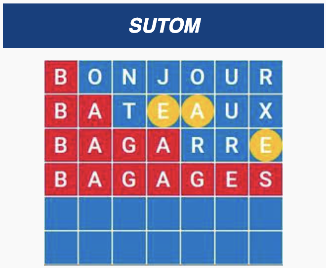

<p align="center">
  
</p>

# Sutom

This little project is about playing the [sutom](https://sutom.nocle.fr/) game.
It is similar to wordle but the first letter is known.

I often play this game and wanted to implement an algorithm to play it 'well'.
This as strong ties to information theory which is a topic I always loved
studying and thinking about.

My goal was to think about an information theoretic algorithm by thinking 'from
first principles' and recollecting what I know about information theory.

For instance, I did not want to re-watch
[3b1b video](https://www.youtube.com/watch?v=v68zYyaEmEA) on his wordle
implementation. I will treat myself later with that one. I have already watched
it at the time, so everything should already be somewhere in my mind!

## Usage

I use [uv](https://github.com/astral-sh/uv) to manage this project. To get
started, simply run:

```bash
uv sync // create .venv and install dependancies
source .venv/bin/activate // activate the virtual environment

python main.py
```

### Main script

The main script currently looks something like this:

```py
if __name__ == "__main__":
    ground_truth_word = "amour"
    play(ground_truth_word, player_kind=PlayerKind.AI, max_iter=10)
```

if you want to play the game, change the `player_kind` argument to
`PlayerKind.HUMAN`.

The 'AI' player implements a simple sampling strategy I describe
[here](./src/info_theoretic_player.md).
